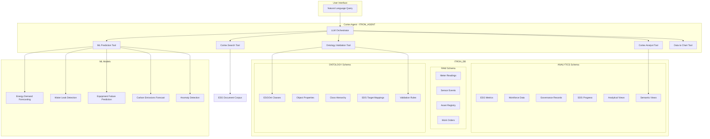

# Plan: Itron Snowflake Intelligence Agent

## Context

### Research Findings

**Itron's Business Domain:**

- Utility infrastructure company managing energy, water, and city services
- Products: Smart meters (electric, gas, water), Grid Edge Intelligence, Gen6 network platform, UtilityIQ application suite
- 16+ million DI-enabled meters shipped, 100+ million endpoints under management
- Key capabilities: Meter Data Management (MDM), AMI, IoT sensors, Distributed Energy Resource Management (DERMS)
- 2025 Sustainability Report: 8.7M metric tons GHG avoided, 56% cumulative Scope 1+2 reduction from 2019 baseline, net-zero by 2050 target

**ESGOnt Ontology Structure (from OWL file at github.com/ESGOnt/esgontology):**

- **Top-level Classes:** Category, Action, Assessment, Metric, SDG, Target, Indicator
- **Environmental Categories:** Energy, Water, Emissions, Waste, Biodiversity
- **Social Categories:** Workforce, Community, SupplyChain, CustomerPrivacy
- **Governance Categories:** Compliance, Ethics, BoardDiversity, RiskManagement
- **Object Properties:** belongsToCategory, hasIndicator, hasTarget, associatesWith, hasMetric, hasAssessmentValue, contributesTo, measuredBy, impactsSDG
- **Individuals:** AssessmentNode1, CalculatedValue1 (example assessment instances)
- **SDG Integration:** Imports UN SDG ontology, maps ESG metrics to specific SDG targets

**Key Design Decision - Ontology as Both Lookup AND Constraint:** The ESGOnt will serve dual purposes:

1. **Reference Lookup:** Agent queries ontology tables to classify metrics, find SDG alignments, and provide deterministic category mappings
2. **Constraint System:** Custom UDFs validate LLM-generated responses against ontology rules (e.g., ensuring a metric is classified under the correct ESG pillar, that SDG target mappings are valid)

### Existing Project State

- Working directory: `/Users/sdickson/Itron/`
- Files present: `Snowflake_Logo.svg`, `itron-agent.md` (project template)
- No existing SQL files or directory structure

---

## Architecture Overview



---

## Implementation Steps

### Step 1: Database and Schema Setup (`sql/setup/01_database_and_schema.sql`)

Create the foundational Snowflake objects:

```sql
-- Database
CREATE DATABASE IF NOT EXISTS ITRON_DB;

-- Schemas
CREATE SCHEMA IF NOT EXISTS ITRON_DB.RAW;        -- Raw operational data
CREATE SCHEMA IF NOT EXISTS ITRON_DB.ANALYTICS;  -- Analytical views and ESG metrics
CREATE SCHEMA IF NOT EXISTS ITRON_DB.ONTOLOGY;   -- ESGOnt ontology tables

-- Warehouse
CREATE OR REPLACE WAREHOUSE ITRON_WH WITH
    WAREHOUSE_SIZE = 'X-SMALL'
    AUTO_SUSPEND = 300
    AUTO_RESUME = TRUE
    INITIALLY_SUSPENDED = TRUE
    COMMENT = 'Warehouse for Itron Intelligence Agent';
```

### Step 2: Table Definitions (`sql/setup/02_create_tables.sql`)

**RAW Schema Tables:**

| Table            | Description                                                   |
| ---------------- | ------------------------------------------------------------- |
| `METERS`         | Asset registry for all meter endpoints (electric, gas, water) |
| `METER_READINGS` | Interval consumption data from smart meters                   |
| `SENSOR_EVENTS`  | IoT sensor telemetry (temperature, pressure, flow, voltage)   |
| `GRID_ASSETS`    | Infrastructure assets (transformers, pipes, substations)      |
| `WORK_ORDERS`    | Maintenance and field service records                         |
| `OUTAGE_EVENTS`  | Grid/water outage incidents                                   |
| `CUSTOMERS`      | Utility customer accounts                                     |

**ANALYTICS Schema Tables:**

| Table                       | Description                                           |
| --------------------------- | ----------------------------------------------------- |
| `ESG_ENVIRONMENTAL_METRICS` | GHG emissions, energy consumption, water usage, waste |
| `ESG_SOCIAL_METRICS`        | Workforce diversity, safety, community investment     |
| `ESG_GOVERNANCE_METRICS`    | Board composition, compliance, ethics reports         |
| `SDG_PROGRESS`              | Progress against UN SDG targets                       |
| `CARBON_EMISSIONS`          | Detailed Scope 1/2/3 emissions tracking               |
| `WATER_CONSERVATION`        | Water savings and non-revenue water metrics           |
| `ENERGY_EFFICIENCY`         | Grid loss reduction and demand response metrics       |
| `ESG_DOCUMENTS`             | Sustainability reports, policies (for Cortex Search)  |

**ONTOLOGY Schema Tables:**

| Table                         | Description                                     |
| ----------------------------- | ----------------------------------------------- |
| `ONTOLOGY_CLASSES`            | All ESGOnt OWL classes with hierarchy           |
| `ONTOLOGY_PROPERTIES`         | Object and data properties                      |
| `ONTOLOGY_RELATIONSHIPS`      | Class-to-class relationships (subClassOf, etc.) |
| `ONTOLOGY_SDG_MAPPINGS`       | ESG metric to SDG target deterministic mappings |
| `ONTOLOGY_VALIDATION_RULES`   | Rules for constraining LLM responses            |
| `ONTOLOGY_METRIC_DEFINITIONS` | Standard metric definitions with units/formulas |

### Step 3: ESGOnt Ontology Loading (`sql/setup/03_ESGOnt_Ontology.sql`)

Parse the OWL/RDF structure into relational tables. Key classes from the ontology:

**Environmental Classes:** Energy, Water, Emissions, Waste, WasteReduction, WasteRecycling, WaterEfficiency, WaterRecycling, WaterUsage, WasteOutput, WasteProcessing, CarbonEmissions, RenewableEnergy, EnergyConsumption, Biodiversity

**Social Classes:** Workforce, Community, SupplyChain, CustomerPrivacy, HealthAndSafety, DiversityAndInclusion

**Governance Classes:** Compliance, Ethics, BoardDiversity, RiskManagement, Transparency, AntiCorruption

**Validation Rules (deterministic constraints for LLM):**

- Metric-to-Category mapping (e.g., "GHG Emissions" MUST belong to "Environmental > Emissions")
- SDG alignment rules (e.g., "Water conservation" MUST map to SDG 6)
- Unit validation (e.g., emissions MUST be in tCO2e, energy in MWh/GWh)
- Assessment hierarchy (metric -> indicator -> target -> SDG goal)

### Step 4: Synthetic Data Generation (`sql/data/04_generate_synthetic_data.sql`)

Generate realistic data patterns reflecting Itron's operations:

- **Meter Readings:** 50,000+ interval readings across 500 meters (electric/gas/water), with seasonal patterns, demand peaks
- **Sensor Events:** 100,000+ IoT events with normal/anomalous patterns
- **ESG Metrics:** 3 years of quarterly ESG KPIs matching Itron's published sustainability data (8.7M tCO2e avoided, 56% Scope 1+2 reduction)
- **Work Orders:** 5,000+ maintenance records with equipment types and outcomes
- **Outages:** 200+ outage events with duration, customers affected, root causes

### Step 5: Analytical Views (`sql/views/05_create_views.sql`)

Create views that aggregate raw data into analytical summaries:

- `V_METER_DAILY_CONSUMPTION` - Daily aggregated meter readings
- `V_ASSET_HEALTH_SCORES` - Composite health scoring for grid assets
- `V_ESG_QUARTERLY_SUMMARY` - Quarterly ESG performance dashboard
- `V_CARBON_INTENSITY` - Carbon intensity by energy source and region
- `V_WATER_LOSS_ANALYSIS` - Non-revenue water and leak indicators
- `V_GRID_RELIABILITY` - SAIDI/SAIFI reliability indices
- `V_SDG_ALIGNMENT_SCORECARD` - SDG progress with ontology-validated mappings
- `V_ONTOLOGY_METRIC_CATALOG` - All metrics with their ESGOnt classification

### Step 6: Semantic Views (`sql/views/06_create_semantic_views.sql`)

Create semantic views for Cortex Analyst (text-to-SQL):

**ITRON\_OPERATIONS\_SV** - Operations semantic view covering:

- Meter readings (consumption patterns, peak demand)
- Asset health and maintenance
- Grid reliability metrics
- Customer service metrics

**ITRON\_ESG\_SV** - ESG semantic view covering:

- Environmental metrics (emissions, energy, water, waste)
- Social metrics (workforce, safety, community)
- Governance metrics (compliance, ethics, board)
- SDG progress tracking

Both views will include:

- Rich synonyms for natural language matching
- Comments explaining business context
- AI\_SQL\_GENERATION instructions for Itron-specific terminology
- AI\_QUESTION\_CATEGORIZATION to route ESG vs. operations questions
- Verified queries for common patterns

### Step 7: Cortex Search Service (`sql/search/07_create_cortex_search.sql`)

```sql
CREATE OR REPLACE CORTEX SEARCH SERVICE ITRON_DB.ANALYTICS.ESG_SEARCH_SERVICE
  ON CONTENT
  ATTRIBUTES DOCUMENT_TYPE, ESG_PILLAR, SDG_GOAL, YEAR
  WAREHOUSE = ITRON_WH
  TARGET_LAG = '1 hour'
  COMMENT = 'Search over Itron ESG documents, policies, and sustainability reports'
AS
  SELECT
    DOCUMENT_ID,
    TITLE,
    CONTENT,
    DOCUMENT_TYPE,
    ESG_PILLAR,
    SDG_GOAL,
    YEAR,
    SOURCE
  FROM ITRON_DB.ANALYTICS.ESG_DOCUMENTS;
```

### Step 8: ML Models (`notebooks/08_ml_models.ipynb` + `sql/models/09_ml_model_functions.sql`)

Five ML models trained in Snowpark Python:

| Model                     | Algorithm                   | Input                              | Output                 |
| ------------------------- | --------------------------- | ---------------------------------- | ---------------------- |
| Energy Demand Forecast    | Time-series (ARIMA/Prophet) | Historical readings + weather      | Next 7/30 day demand   |
| Water Leak Detection      | Classification (XGBoost)    | Flow patterns + pressure           | Leak probability score |
| Equipment Failure         | Survival analysis           | Age, readings, maintenance history | Failure probability    |
| Carbon Emissions Forecast | Regression                  | Energy mix, consumption trends     | Projected tCO2e        |
| Anomaly Detection         | Isolation Forest            | Meter reading patterns             | Anomaly score + type   |

Each model exposed as a UDF for the agent:

```sql
CREATE OR REPLACE FUNCTION ITRON_DB.ANALYTICS.AGENT_PREDICT_DEMAND(METER_ID VARCHAR, HORIZON_DAYS NUMBER)
RETURNS ARRAY
AS $$
  SELECT ARRAY_AGG(OBJECT_CONSTRUCT(
    'date', PREDICTION_DATE,
    'predicted_kwh', PREDICTED_VALUE,
    'confidence_lower', LOWER_BOUND,
    'confidence_upper', UPPER_BOUND
  )) FROM (...)
$$;
```

### Step 9: Agent Creation (`sql/agent/10_create_agent.sql`)

The agent integrates all components with ontology-aware orchestration:

```yaml
CREATE OR REPLACE AGENT ITRON_DB.ANALYTICS.ITRON_AGENT
  COMMENT = 'Itron Intelligence Agent - ESG and Operations NLQ'
  PROFILE = '{"display_name": "Itron Intelligence Assistant", "color": "blue"}'
  FROM SPECIFICATION
  $$
  models:
    orchestration: auto

  orchestration:
    budget:
      seconds: 360
      tokens: 32000

  instructions:
    response: "You are the Itron Intelligence Assistant. Provide data-driven answers about energy, water, and gas operations, ESG performance, and sustainability metrics. Always validate ESG classifications against the ESGOnt ontology before responding. When reporting metrics, include the SDG alignment and ESG pillar classification. Present numerical results with appropriate units."
    orchestration: "For operational questions about meters, consumption, assets, or grid reliability, use ItronOperationsAnalyst. For ESG, sustainability, emissions, or SDG questions, use ItronESGAnalyst. For policy or report lookups, use ESGSearch. Always call OntologyValidator to verify ESG metric classifications before presenting results. For predictions and forecasts, use the appropriate ML tool. Use data_to_chart for visualizations."
    sample_questions:
      - question: "What was our total GHG emissions reduction last quarter compared to baseline?"
      - question: "Which water meters show anomalous consumption patterns this month?"
      - question: "How does our carbon intensity align with SDG 13 targets?"
      - question: "Predict energy demand for the next 30 days across all regions."
      - question: "What is our current grid reliability SAIDI score?"

  tools:
    - tool_spec:
        type: "cortex_analyst_text_to_sql"
        name: "ItronOperationsAnalyst"
        description: "Queries operational data including meter readings, sensor events, asset health, work orders, grid reliability, and customer service metrics"
    - tool_spec:
        type: "cortex_analyst_text_to_sql"
        name: "ItronESGAnalyst"
        description: "Queries ESG performance data including environmental metrics, social metrics, governance metrics, carbon emissions, water conservation, and SDG progress"
    - tool_spec:
        type: "cortex_search"
        name: "ESGSearch"
        description: "Searches Itron sustainability reports, ESG policies, and compliance documents for qualitative information"
    - tool_spec:
        type: "generic"
        name: "OntologyValidator"
        description: "Validates ESG metric classifications against the ESGOnt ontology. Returns the correct ESG pillar, category, SDG alignment, and unit of measurement for any metric. Use this to ensure deterministic accuracy of ESG categorizations."
    - tool_spec:
        type: "generic"
        name: "PredictDemand"
        description: "Forecasts energy demand for specified meters over a given time horizon"
    - tool_spec:
        type: "generic"
        name: "DetectAnomalies"
        description: "Identifies anomalous patterns in meter readings and sensor data"
    - tool_spec:
        type: "generic"
        name: "PredictEquipmentFailure"
        description: "Returns failure probability scores for grid assets and meters"
    - tool_spec:
        type: "data_to_chart"
        name: "data_to_chart"
        description: "Generates visualizations from query results"

  tool_resources:
    ItronOperationsAnalyst:
      semantic_view: "ITRON_DB.ANALYTICS.ITRON_OPERATIONS_SV"
    ItronESGAnalyst:
      semantic_view: "ITRON_DB.ANALYTICS.ITRON_ESG_SV"
    ESGSearch:
      name: "ITRON_DB.ANALYTICS.ESG_SEARCH_SERVICE"
      max_results: "10"
      title_column: "TITLE"
      id_column: "DOCUMENT_ID"
    OntologyValidator:
      type: "function"
      identifier: "ITRON_DB.ONTOLOGY.VALIDATE_ESG_METRIC"
      execution_environment:
        type: "warehouse"
        warehouse: "ITRON_WH"
    PredictDemand:
      type: "function"
      identifier: "ITRON_DB.ANALYTICS.AGENT_PREDICT_DEMAND"
      execution_environment:
        type: "warehouse"
        warehouse: "ITRON_WH"
    DetectAnomalies:
      type: "function"
      identifier: "ITRON_DB.ANALYTICS.AGENT_DETECT_ANOMALIES"
      execution_environment:
        type: "warehouse"
        warehouse: "ITRON_WH"
    PredictEquipmentFailure:
      type: "function"
      identifier: "ITRON_DB.ANALYTICS.AGENT_PREDICT_FAILURE"
      execution_environment:
        type: "warehouse"
        warehouse: "ITRON_WH"
  $$;
```

### Step 10: Documentation and SVG Diagrams

**Files to generate:**

- `README.md` - Project overview with setup instructions
- `docs/AGENT_SETUP.md` - Step-by-step agent configuration guide
- `docs/DEPLOYMENT_SUMMARY.md` - Current deployment status
- `docs/questions.md` - 30+ complex test questions
- `docs/images/architecture.svg` - System architecture (mermaid-style layout as SVG)
- `docs/images/deployment_flow.svg` - Execution order flow diagram
- `docs/images/ml_models.svg` - ML pipeline with inputs/outputs
- `docs/images/query_toolchain.svg` - Example queries showing tool path and ontology usage

**Query Tool Chain SVG** will show:

1. "What were our Scope 1 emissions last quarter?" -> ItronESGAnalyst -> OntologyValidator (confirms Scope 1 = Environmental > Emissions > Direct) -> data\_to\_chart
2. "Which water meters are likely leaking?" -> DetectAnomalies -> ItronOperationsAnalyst -> OntologyValidator (maps to SDG 6)
3. "How does our workforce diversity compare to ESG benchmarks?" -> ItronESGAnalyst -> ESGSearch -> OntologyValidator (confirms Social > Workforce > DiversityAndInclusion)

---

## Verification

1. **SQL Compilation:** Each SQL file will be tested with `only_compile=true` before moving to the next
2. **Ontology Integrity:** Verify ontology tables contain all 50+ classes from the OWL file with correct hierarchy
3. **Semantic View Validation:** Run `DESCRIBE SEMANTIC VIEW` on both views to confirm all dimensions/metrics resolve
4. **Agent Creation:** Verify agent creates successfully and responds to sample questions
5. **Tool Chain Testing:** Confirm OntologyValidator is called for ESG queries (visible in tool path)
6. **SVG Rendering:** Verify all SVG files render correctly (valid XML, proper viewBox)

---

## Critical Files

- `sql/setup/03_ESGOnt_Ontology.sql` - Core ontology loading with validation rules; deterministic constraint foundation
- `sql/views/06_create_semantic_views.sql` - Semantic views that power Cortex Analyst text-to-SQL
- `sql/agent/10_create_agent.sql` - Agent specification with tool routing and ontology integration
- `sql/models/09_ml_model_functions.sql` - UDFs exposing ML predictions to the agent
- `docs/images/query_toolchain.svg` - Visual demonstration of deterministic+probabilistic query flow
