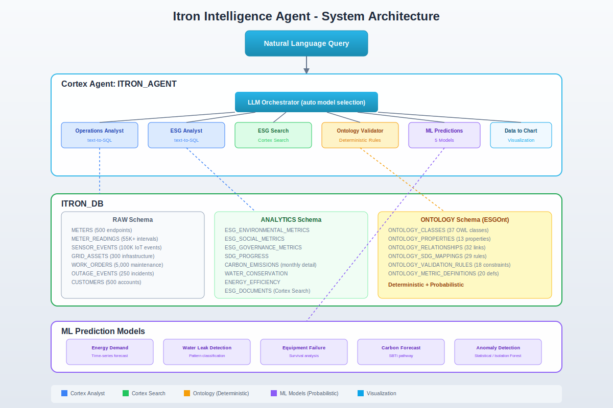
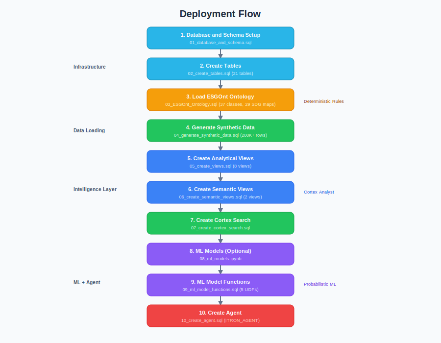
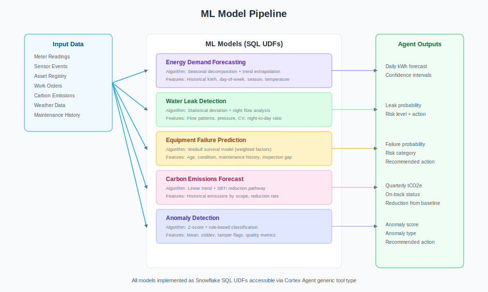
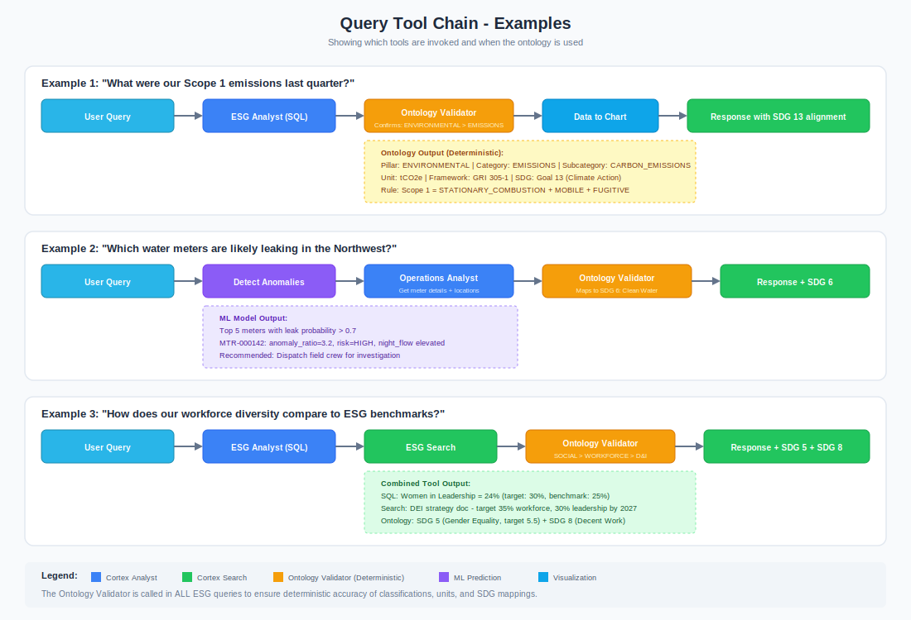

# Itron Intelligence Agent

A Snowflake Intelligence Agent that integrates Itron's operational data (smart meters, grid assets, IoT sensors) with the ESGOnt Ontology to provide deterministic rule-validated answers to natural language queries about ESG performance, operational metrics, and sustainability alignment.

## Overview

<html>
<table border="1" cellpadding="8" cellspacing="0">
<tr><th>Component</th><th>Description</th></tr>
<tr><td>Customer</td><td>Itron - Smart energy, water, and city services</td></tr>
<tr><td>Database</td><td>ITRON_DB</td></tr>
<tr><td>Warehouse</td><td>ITRON_WH</td></tr>
<tr><td>Agent</td><td>ITRON_AGENT</td></tr>
<tr><td>Business Domain</td><td>Natural Resource Management / Utility Infrastructure</td></tr>
<tr><td>Ontology</td><td>ESGOnt (CC0-1.0) - ESG + SDG alignment framework</td></tr>
</table>
</html>

## Architecture



## Key Capabilities

- **Natural Language Queries** across operational and ESG data
- **Deterministic Ontology Validation** ensures LLM responses are verified against ESGOnt rules
- **5 ML Prediction Models**: Energy demand forecasting, water leak detection, equipment failure prediction, carbon emissions forecasting, anomaly detection
- **SDG Alignment Tracking** with automatic metric-to-goal mapping
- **Multi-pillar ESG Reporting** covering Environmental, Social, and Governance metrics

## Project Structure

```
/
├── README.md
├── Snowflake_Logo.svg
├── docs/
│   ├── AGENT_SETUP.md
│   ├── DEPLOYMENT_SUMMARY.md
│   ├── questions.md
│   └── images/
│       ├── architecture.svg
│       ├── deployment_flow.svg
│       ├── ml_models.svg
│       └── query_toolchain.svg
├── notebooks/
│   └── 08_ml_models.ipynb
└── sql/
    ├── setup/
    │   ├── 01_database_and_schema.sql
    │   ├── 02_create_tables.sql
    │   └── 03_ESGOnt_Ontology.sql
    ├── data/
    │   └── 04_generate_synthetic_data.sql
    ├── views/
    │   ├── 05_create_views.sql
    │   └── 06_create_semantic_views.sql
    ├── search/
    │   └── 07_create_cortex_search.sql
    ├── models/
    │   └── 09_ml_model_functions.sql
    └── agent/
        └── 10_create_agent.sql
```

## Quick Start

Execute SQL files in order:

```bash
# 1. Database setup
snowsql -f sql/setup/01_database_and_schema.sql

# 2. Create tables
snowsql -f sql/setup/02_create_tables.sql

# 3. Load ESGOnt ontology
snowsql -f sql/setup/03_ESGOnt_Ontology.sql

# 4. Generate synthetic data
snowsql -f sql/data/04_generate_synthetic_data.sql

# 5. Create analytical views
snowsql -f sql/views/05_create_views.sql

# 6. Create semantic views
snowsql -f sql/views/06_create_semantic_views.sql

# 7. Create Cortex Search service
snowsql -f sql/search/07_create_cortex_search.sql

# 8. (Optional) Run ML notebook
# Open notebooks/08_ml_models.ipynb in Snowflake Notebooks

# 9. Create ML model functions
snowsql -f sql/models/09_ml_model_functions.sql

# 10. Create the agent
snowsql -f sql/agent/10_create_agent.sql
```

## Deployment Flow



## ESGOnt Ontology Integration

The ESGOnt ontology serves as **both a reference lookup AND a constraint system**:

1. **Reference Lookup**: The agent queries ontology tables to classify metrics, find SDG alignments, and retrieve standardized definitions
2. **Constraint System**: A custom validation UDF (`VALIDATE_ESG_METRIC`) is called on every ESG query to deterministically verify classifications

<html>
<table border="1" cellpadding="8" cellspacing="0">
<tr><th>Ontology Component</th><th>Snowflake Table</th><th>Purpose</th></tr>
<tr><td>OWL Classes</td><td>ONTOLOGY_CLASSES</td><td>ESG taxonomy hierarchy</td></tr>
<tr><td>Object Properties</td><td>ONTOLOGY_PROPERTIES</td><td>Relationship definitions</td></tr>
<tr><td>Class Hierarchy</td><td>ONTOLOGY_RELATIONSHIPS</td><td>subClassOf relationships</td></tr>
<tr><td>SDG Mappings</td><td>ONTOLOGY_SDG_MAPPINGS</td><td>Metric-to-SDG deterministic rules</td></tr>
<tr><td>Validation Rules</td><td>ONTOLOGY_VALIDATION_RULES</td><td>Constraints that check LLM output</td></tr>
<tr><td>Metric Definitions</td><td>ONTOLOGY_METRIC_DEFINITIONS</td><td>Standard units and formulas</td></tr>
</table>
</html>

## ML Models



## Query Tool Chain



## References

- **ESGOnt**: [GitHub](https://github.com/ESGOnt/esgontology) | [Paper](https://www.sciencedirect.com/science/article/pii/S266691612500074X)
- **Itron**: [Website](https://www.itron.com) | [2025 Sustainability Report](https://na.itron.com/fr/w/itron-publishes-2025-corporate-sustainability-report)
- **Snowflake**: [Cortex Agent Docs](https://docs.snowflake.com/en/user-guide/snowflake-cortex/cortex-agents-manage) | [Semantic Views](https://docs.snowflake.com/en/user-guide/views-semantic/sql)
